## 📌 About Me
- National Hackathon Winner @ Project Morpheus built Nivesh-Nidhi, a blockchain-powered fintech platform for chit funds.
- Actively contributing to open source looking to learn, collaborate, and grow in public
- Saw mythology being misrepresented online building Myth.ai, an AI chatbot grounded in accurate cultural knowledge

## 🧠 My Focus Areas
-  Full-Stack Web Development 
- AI/ML Integration 
- Open Source

## 🛠️ Tech Stack

## 📊 GitHub Stats & Trophies

	
	

	

	

	

## 🔗 Connect with Me

   

<picture>
	<source media="(prefers-color-scheme: dark)" srcset="https://raw.githubusercontent.com/tobiasmeyhoefer/tobiasmeyhoefer/output/github-snake-dark.svg" />
	<source media="(prefers-color-scheme: light)" srcset="https://raw.githubusercontent.com/tobiasmeyhoefer/tobiasmeyhoefer/output/github-snake.svg" />
	
</picture>

	

